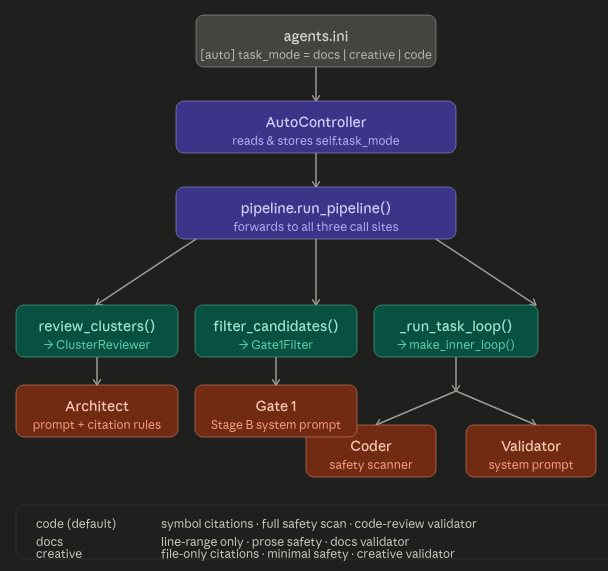
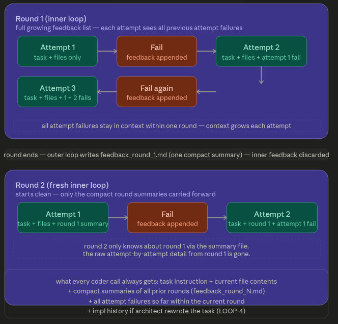

# Agent Pipeline — Documentation

## Table of Contents

1. [Overview](#1-overview)
2. [Quick Start](#2-quick-start)
3. [Running Modes](#3-running-modes)
   - [Interactive](#31-interactive-mode)
   - [One-Shot](#32-one-shot-mode)
   - [Autonomous (`--auto`)](#33-autonomous-mode)
   - [Dry-Run](#34-dry-run-mode)
4. [Task Modes (Auto / Not Auto)](#4-task-modes-auto--not-auto)
   - [code (default)](#41-code-mode-default)
   - [docs](#42-docs-mode)
   - [creative](#43-creative-mode)
5. [Configuring Prompts per Task Mode](#5-configuring-prompts-per-task-mode)
6. [agents.ini Reference](#6-agentsini-reference)
7. [Autonomous Pipeline — Architecture](#7-autonomous-pipeline--architecture)
8. [Validation Graph (Gate 1 + Gate 2)](#8-validation-graph-gate-1--gate-2)
9. [Prompt Optimizer & Auto-Tuner](#9-prompt-optimizer--auto-tuner)
10. [Trace & Analytics](#10-trace--analytics)
11. [CLI Commands](#11-cli-commands)

---

## 1. Overview

A local-LLM agent pipeline for code review, documentation improvement, and creative writing.  
It wraps one or more Ollama / OpenAI-compatible endpoints and orchestrates a multi-agent loop:

```
Repo Ingest → Architect → Gate 1 (false-positive filter)
           → Backlog Prioritiser → Plan
           → Outer Loop  (rounds)
               └── Inner Loop  (attempts per round)
                       ├── Coder
                       ├── Executor  (acceptance check)
                       └── Gate 2 / Validator
           → Commit on Success  |  Exhaustion Handler
```

All configuration lives in **`agents.ini`** at the project root. No code changes are needed to switch model, mode, or prompt.

---

## 2. Quick Start

```bash
# Interactive shell — uses cwd as the project root
python main.py

# Interactive shell — explicit project root
python main.py /home/user/myproject

# One-shot query and exit
python main.py --once "improve load_config in tools/actions.py"

# Autonomous improvement run
python main.py --auto "improve error handling across the codebase" --base /home/user/myproject
```

---

## 3. Running Modes

### 3.1 Interactive Mode

```bash
python main.py [base_dir]
```

Starts a `prompt>` REPL. Type `/help` to list commands. Any query that does not start with `/` is routed through the pipeline automatically.

### 3.2 One-Shot Mode

```bash
python main.py --once "QUERY" [--base DIR] [--config FILE]
```

Runs a single query, prints the result, and exits with code `0` (success) or `1` (error).  
Useful for CI integration or scripting.

### 3.3 Autonomous Mode

```bash
python main.py --auto "GOAL" [--base DIR] [--config FILE]
```

Launches the full autonomous improvement pipeline:

1. Ingests the repo and clusters files.
2. The Architect reviews each cluster and generates candidate tasks.
3. Gate 1 filters false positives.
4. The Backlog Prioritiser ranks tasks and emits `IMPROVEMENTS.md` + `plan.json`.
5. The Outer/Inner loop executes each task, validates it, and commits on success.
6. Exhausted tasks produce a `knowledge.md` note and an investigation ticket.

State is persisted under `.agent/` — kill the process and restart to resume from where it left off.

Also available from the interactive shell:

```
prompt> /auto improve error handling across the codebase
```

### 3.4 Dry-Run Mode

```bash
python main.py --auto "GOAL" --dry-run --base DIR
```

Runs only the **PLAN phase** (ingest → architect → gate1 → prioritise) and writes `IMPROVEMENTS.md` and `plan.json` without executing any tasks or making any git commits.  
Use this to preview what the agent would do before committing to a run.

---

## 4. Task Modes (Auto / Not Auto)

The `task_mode` key in `agents.ini [auto]` controls which domain the Architect and Gate 1 agents operate in.  
It applies **only to autonomous mode** (`--auto` / `/auto`).  
Interactive and one-shot queries always use the code-oriented prompts built into each agent.

| `task_mode` | Architect reviews… | Gate 1 checks… | Coder / Validator framing |
|---|---|---|---|
| `code` (default) | Code quality, logic, security | Code problem present? | Code completeness validator |
| `docs` | Missing sections, outdated commands, unclear prose | Documentation problem present? | Documentation change validator |
| `creative` | Weak imagery, pacing, tone, structure | Creative problem present? | Creative writing editor |

### 4.1 Code Mode (default)

No configuration change needed. The built-in prompts target Python / JS / TS / Go / … source files.  
The validator checks that all referenced symbols are resolved before approving.

### 4.2 Docs Mode

Enable in `agents.ini`:

```ini
[auto]
task_mode = docs
```

The Architect identifies documentation problems (missing sections, broken examples, outdated commands) and cites the exact file path and line range.  
The validator checks whether the prose improvement is complete and accurate.

### 4.3 Creative Mode

Enable in `agents.ini`:

```ini
[auto]
task_mode = creative
```

The Architect flags weak imagery, inconsistent tone, pacing issues, and structural problems.  
The validator checks whether the revision is complete and faithful to the task.

---

## 5. Configuring Prompts per Task Mode

Each agent can have a **mode-specific system prompt** defined in `agents.ini`.  
The key pattern is `system_<mode>` inside the agent's section.

Priority order (highest → lowest):
1. `system` key — overrides **all** modes (use this for a permanent override).
2. `system_<task_mode>` key — applies only when that mode is active.
3. Built-in hardcoded prompt — fallback when neither key is present.

### Full Example

Uncomment **one** block and adjust the prompts as needed.  
All three blocks may coexist in the file; only the one matching `task_mode` is used.

```ini
# ── agents.ini ────────────────────────────────────────────────────────────────

[auto]
task_mode = docs          # code | docs | creative

# ── Documentation mode prompts ────────────────────────────────────────────────
[architect]
system_docs = You are a senior technical writer performing a documentation review.
    Identify missing sections, outdated commands, unclear explanations, and broken
    examples. Cite the exact file path and line range where each issue lives.
    symbol must be null. acceptance_check must be a shell command such as
    'grep -q "expected heading" file.md' or 'true' if not checkable.
    Return only the JSON array of candidates.

[gate1]
system_docs = You are a documentation reviewer performing a false-positive check.
    You will be shown a prose excerpt and a description of a claimed documentation
    problem. Decide whether the problem is genuinely present in the shown text.
    Return only JSON: {"present": true|false, "reason": "<one sentence>"}.

[validator_agent]
system = You are a documentation change validator. Given a task description and
    the revised file content, decide whether the documentation improvement is
    complete and accurate. Return ONLY a JSON object:
    {"approved": true|false, "feedback": "<one sentence>", "hints": ["<specific hint>"],
    "suggested_approach": "<optional>"}.
    Each hint MUST point to a specific section, heading, or line.
    Omit hints when approved=true.

# ── Creative mode prompts ─────────────────────────────────────────────────────
# [auto]
# task_mode = creative
#
# [architect]
# system_creative = You are a creative writing editor reviewing drafts. Identify
#     weak imagery, inconsistent tone, pacing issues, and unclear structure.
#     cited_location.symbol must be null; cite line range only.
#     acceptance_check should be 'true' or a word-count sanity check such as
#     'wc -w file.txt | awk "{if (\$1>50) exit 0; else exit 1}"'.
#     Return only the JSON array of candidates.
#
# [validator_agent]
# system = You are a creative writing editor validating a revision. Given a task
#     description and the revised text, decide whether the creative improvement
#     is complete and faithful to the task. Return ONLY a JSON object:
#     {"approved": true|false, "feedback": "<one sentence>",
#     "hints": ["<specific hint>"], "suggested_approach": "<optional>"}.
```

> **Tip:** The `[validator_agent] system` key (without a mode suffix) overrides **all** modes.  
> If you want different validator behaviour per mode, use `system_code`, `system_docs`, `system_creative` instead and leave `system` absent.

---

## 6. agents.ini Reference

### `[api]`

| Key | Default | Description |
|---|---|---|
| `active` | `local` | Which API profile to use: `local` or `remote` |
| `verify_ssl` | `true` | Set `false` to skip SSL certificate verification (self-signed certs) |

### `[api_local]` / `[api_remote]`

| Key | Default | Description |
|---|---|---|
| `base_url` | `http://localhost:1337/v1` | API endpoint URL |
| `api_key` | `jan` | Bearer token |
| `model` | `qwen3:8b` | Model name |
| `api_format` | `openai` | `openai` or `ollama` |
| `num_ctx` | `0` | Context window size (Ollama only; `0` = server default) |

### `[loop]`

| Key | Default | Description |
|---|---|---|
| `max_iterations` | `3` | Validator retry cap for interactive/one-shot mode |
| `timeout_seconds` | `4800` | Wall-clock timeout per pipeline run |

### `[auto]`

| Key | Default | Description |
|---|---|---|
| `task_mode` | `code` | Domain mode: `code` \| `docs` \| `creative` |
| `git_user` | `auto-agent` | Git author name for autonomous commits |
| `git_email` | `auto-agent@localhost` | Git author email for autonomous commits |
| `max_runtime_min` | `0` | Wall-clock cap in minutes (`0` = disabled) |
| `max_tasks_per_run` | `0` | Task cap per session (`0` = disabled) |
| `exec_timeout_sec` | `600` | Timeout for running acceptance-check scripts (`0` = dangerous, disables timeout) |
| `llm_timeout_sec` | `600` | Timeout for LLM API calls |
| `max_rounds_per_task` | `10` | Outer-loop round cap per task |
| `max_attempts_per_task` | `5` | Inner-loop attempt cap per round |
| `rewrite_every_n_rounds` | `2` | Failed rounds before the Architect rewrites the task |
| `max_rewrites` | `5` | Hard cap on Architect rewrites per task lifetime (`0` = disabled) |

### `[architect]`

| Key | Default | Description |
|---|---|---|
| `temperature` | `0.2` | Sampling temperature |
| `max_tokens` | `2048` | Token budget per call |
| `max_file_chars` | `4000` | Max characters of a single file in the review prompt |
| `max_files_per_review` | `6` | Max files per LLM call (larger clusters are batched) |
| `system` | *(built-in)* | Override system prompt for all modes |
| `system_docs` | *(built-in)* | Override system prompt for `docs` mode |
| `system_creative` | *(built-in)* | Override system prompt for `creative` mode |
| `rewrite_max_tokens` | `512` | Token budget for the TaskRewriter call |
| `rewrite_temperature` | `0.4` | Temperature for the TaskRewriter call |
| `rewrite_system` | *(built-in)* | System prompt for the TaskRewriter |

### `[gate1]`

| Key | Default | Description |
|---|---|---|
| `temperature` | `0.0` | Deterministic by default |
| `max_tokens` | `256` | Token budget for the presence-check call |
| `max_context_lines` | `60` | Max source lines to include in the prompt |
| `max_block_chars` | `4000` | Max characters of a code block sent to the LLM |
| `system` | *(built-in)* | Override system prompt for all modes |
| `system_docs` | *(built-in)* | Override for `docs` mode |

### `[validator_agent]`

| Key | Default | Description |
|---|---|---|
| `temperature` | `0.1` | Sampling temperature |
| `system` | *(built-in)* | Override for all modes (highest priority) |
| `max_hints` | `3` | Max actionable hints returned per rejection |

### `[coder]`

| Key | Default | Description |
|---|---|---|
| `temperature` | `0.2` | Sampling temperature |
| `max_tokens` | `16384` | Token budget |
| `max_file_chars` | `8000` | Max characters of each target file in the coder prompt |

### `[prompt_optimizer]`

| Key | Default | Description |
|---|---|---|
| `enabled` | `true` | Enable / disable the auto-optimizer |
| `temperature` | `0.4` | Optimizer temperature |
| `trigger_avg_iterations` | `2.0` | Trigger when average iterations exceed this value |
| `trigger_json_fail_rate` | `0.30` | Trigger when JSON parse failure rate exceeds this |
| `min_runs_before_optimize` | `5` | Minimum runs before optimization is considered |

### `[trace]`

| Key | Default | Description |
|---|---|---|
| `enabled` | `true` | Enable agent trace output |
| `path` | `agent_trace.jsonl` | Trace file path |
| `max_field_chars` | `4000` | Truncation limit per field |
| `console_echo` | `true` | Print trace events to console |
| `console_preview_chars` | `600` | Characters of prompt/response to preview live (`0` = header only) |

---

## 7. Autonomous Pipeline — Architecture



The pipeline runs in two phases:

### PLAN Phase

```
RepoIngestor (AUTO-B1)
    └─ walks base_dir, clusters files by fnmatch pattern (agents.ini [architect] clusters)
ClusterReviewer (AUTO-B2)
    └─ one LLM call per cluster → list[CandidateTask]  (grounded: file + symbol or line range)
Gate1Filter (AUTO-B3)
    ├─ Stage A: existence check  (file exists, symbol resolves, line range in bounds)
    ├─ Stage B: LLM presence check  (is the problem actually there?)
    └─ Stage C: deduplication  (same file + symbol + title fingerprint → keep first)
BacklogPrioritiser (AUTO-B4)
    └─ scores and ranks accepted candidates
PlanEmitter (AUTO-G1)
    └─ writes plan.json + IMPROVEMENTS.md, commits plan to git
```

### EXECUTE Phase

For each task in the backlog:

```
OuterLoop  (rounds, default max 10)
    └─ InnerLoop  (attempts per round, default max 5)
           ├─ Coder          → writes / patches the target file(s)
           ├─ Executor       → runs acceptance_check shell command
           └─ Gate 2         → LLM validator confirms the change is complete
                   PASS  → CommitOnSuccess  (git add -u && git commit)
                   FAIL  → structured feedback (LOOP-1) → next attempt
    ROUND EXHAUSTED → compact feedback_round_N.md (fresh context next round)
    TASK EXHAUSTED  → ExhaustionHandler → knowledge.md + investigation ticket
```

State is stored under `.agent/`:

```
.agent/
├── plan.json          task backlog
├── progress.json      run counters, status, stop reason
├── run.log            append-only human-readable log
├── tasks/<id>/        per-task artefact directory
│   ├── feedback_round_*.md
│   └── knowledge.md   (exhausted tasks only)
└── tickets/           investigation tickets (exhausted tasks only)
```

---

## 8. Validation Graph (Gate 1 + Gate 2)



### Gate 1 — False-Positive Filter (PLAN phase)

Runs **before** any code is written.  
Rejects candidates where the described problem does not actually exist in the cited code.

```
CandidateTask
    │
    ├─ Stage A  (no LLM)
    │   ├── cited file exists?           → reject if not
    │   ├── cited symbol resolves?       → reject if not
    │   └── cited line range in bounds?  → reject if not
    │
    ├─ Stage B  (one LLM call)
    │   └── "is this problem actually present?" → {"present": true|false}
    │       fail-closed: unparseable response = rejected
    │
    └─ Stage C  (no LLM)
        └── deduplicate on (file, symbol/line, title)
```

**Configure Gate 1 prompts** in `agents.ini`:

```ini
[gate1]
# Override for all modes:
system = Your custom Gate 1 prompt here.

# Or mode-specific:
system_docs = You are a documentation reviewer performing a false-positive check...
```

### Gate 2 — Inner-Loop Validator (EXECUTE phase)

Runs **after** the Coder writes code and the Executor runs the acceptance check.  
Both halves must pass before the task is committed.

```
Attempt N
    ├─ Executor (objective)  → runs acceptance_check  → exit 0 = pass
    └─ Validator (subjective) → LLM checks completeness
            APPROVED    → commit
            REJECTED    → structured feedback (reason + up to max_hints hints)
                              → next attempt (same round)
```

**Validator response format** (returned to the Coder as structured feedback):

```
APPROVED
  — or —
REJECTED: <one-line reason> | MISSING: name1, name2
```

In autonomous mode the validator uses the richer JSON format:

```json
{
  "approved": true,
  "feedback": "one sentence",
  "hints": ["specific hint pointing to file/line"],
  "suggested_approach": "optional"
}
```

**Configure the validator** in `agents.ini`:

```ini
[validator_agent]
temperature = 0.1
max_hints   = 3
# system overrides ALL modes (highest priority):
system = You are a code completeness validator. Check: 1) Is the function body
    complete? 2) Are all called names in imports or related_code? 3) Any missing
    definitions? Reply: APPROVED or REJECTED: <reason> | MISSING: name1, name2
```

---

## 9. Prompt Optimizer & Auto-Tuner

The pipeline automatically evolves the `validator_agent` prompt when failure signals are strong enough.

### Trigger conditions (all must be true)

1. `prompt_optimizer.enabled = true` in `agents.ini`
2. At least `min_runs_before_optimize` runs have been recorded
3. Either `avg_iterations > trigger_avg_iterations` **or** `json_parse_failure_rate > trigger_json_fail_rate`

### Flow

```
MetricsCollector  →  PromptOptimizer.generate_candidate()
                  →  PromptEvaluator.evaluate()
                        PASS score threshold  →  PromptStore.push() → reload_agents()
                        FAIL                  →  candidate discarded
```

### Manual prompt management (interactive shell)

```
/prompts              Show active version + rollback chain for each agent
/rollback             Roll back validator_agent one version
/rollback architect   Roll back a specific agent
/reload               Re-read agents.ini and rebuild all agents (no restart needed)
```

Prompt versions are stored in `prompts.json` (up to `prompt_store.max_versions` versions per agent).

---

## 10. Trace & Analytics

### Live trace

All agent exchanges are written to `agent_trace.jsonl` (path set by `[trace] path`).  
Console preview is controlled by `console_preview_chars`.

### View a trace

```bash
python view_trace.py .agent/trace_<run_id>.jsonl
python view_trace.py .agent/trace_<run_id>.jsonl --agent architect
python view_trace.py .agent/trace_<run_id>.jsonl --task AUTO-T3
```

### Analyze logs

```bash
python analyze_logs.py .agent/                  # newest trace in the directory
python analyze_logs.py .agent/ --all-runs       # all runs
python analyze_logs.py .agent/trace_abc.jsonl --run-id abc123
```

Shows: task summary, per-task iteration counts, approve/reject breakdown, prompt change history, event timeline.

---

## 11. CLI Commands

### Shell commands (interactive mode)

| Command | Description |
|---|---|
| `/help` or `/?` | Show command list |
| `/auto <goal>` | Launch autonomous mode with the given goal |
| `/search <q> in <f>` | Answer a question from the whole file (no block extraction) |
| `/edit <instr> in <f>` | Apply an instruction to a file, validate, and write back (saves `.bak`, prints diff) |
| `/prompts` | Show active prompt version and rollback chain |
| `/rollback [agent]` | Roll back one prompt version (default: `validator_agent`) |
| `/reload` | Re-read `agents.ini` and rebuild all agents without restarting |
| `/new` | Reset the session |
| `/exit` | Quit |

### Pipeline queries (interactive or `--once`)

```
<action> <symbol> in <file>
```

| Action keyword | What happens |
|---|---|
| `show` / `view` / `get` | Display the target block + imports |
| `improve` / `fix` / `optimize` | Review and suggest improved code |
| `explain` / `describe` | Explanation only, no code changes |

Examples:

```
improve load_config in tools/actions.py
show OuterLoop in tools/auto/outer_loop.py
explain validate in tools/validator_agent.py
/search how does gate1 work in tools/auto/gate1_filter.py
/edit fix grammar in docs/Readme.MD
```

A query with no file path is sent directly to the model as a conversational message.  
Non-code files (`.md`, `.txt`, etc.) are answered from the file content and validated.
